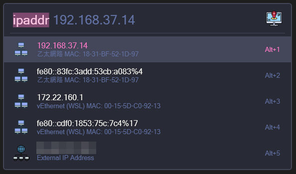

# Flow.Launcher.Plugin.IpMacAddress

A plugin for the [Flow launcher](https://github.com/Flow-Launcher/Flow.Launcher).



## Usage

Enter the keyword `ipaddr`(default). Select from the result to copy to the Clipboard.

## Install

```
pm install IpMacAddress
```

## Attribution

All icon used from [Flaticon](https://www.flaticon.com/).

- <a href="https://www.flaticon.com/free-icons/ip-address" title="ip address icons">Ip address icons created by Freepik - Flaticon</a>
- <a href="https://www.flaticon.com/free-icons/global-network" title="global network icons">Global network icons created by Konkapp - Flaticon</a>
- <a href="https://www.flaticon.com/free-icons/local-area-network" title="local area network icons">Local area network icons created by Andy Horvath - Flaticon</a>
